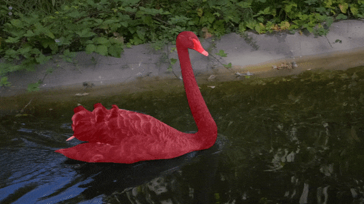

# Pytorch VideoMatch

This is an unofficial Pytorch implementation of [`VideoMatch: Matching based Video Object Segmentation`](https://arxiv.org/pdf/1809.01123.pdf)

<p align="center">
  
</p>

Currently only single object segmentation (DAVIS 2016) is supported. I also didn't implement online model update (see [ch 3.3](https://arxiv.org/pdf/1809.01123.pdf))
and early stop with regards to validation set IOU.

`main.py` is the main entry point to this project, run `python3 main.py -h` to see all the options.

Both in train and eval mode you can change both encoder type and upsample factor for enlarging encoder features. Encoder weights from `torchvision` are used, so model weights will be
downloaded automatically if you don't have them. Try setting the upsample factor as high as possible (before you get `RuntimeError: CUDA out of memory`) since
this controls resulting segmentation resolution/quality.

Code was written for Python 3.6.8 and Pytorch 1.2.0.

## Train
For training first download [DAVIS dataset](https://davischallenge.org/davis2016/code.html) and store it in project root or use `-d` flag to set DAVIS path.

To stop the training and save the model (needs `-s` option) just press `CTRL+C` (SIGINT).

Currently only batch size of 1 is supported for training because of the implementation nature of cosine similarity in [videomatch.py](videomatch.py).

Example:
```bash
python3 main.py -c 0 -m train -t train -s models/vm_vgg.pth -p 416 790 -l 1e-5 -x
```
## Eval
You can also generate segmentation image results for evaluation and video result.

Generated segmentation images appear to be black with image viewer even though it's a binary image. 
Need to add a palette when saving the images.

In case you have enabled the result video visualization (flag `-v`) you need to manually close matplotlib figure or
the evaluation won't continue. Either matplotlib has a bug or I'm doing something wrong...

Example:
```bash
python3 main.py -c 0 -m eval -t val -u -o models/vm_vgg.pth -j vm_results -v
```

## Other
You can run `videomatch.py` with reference image path, reference mask path and multiple test image paths to visualize foreground and background probabilities.

Example:
```bash
python3 videomatch.py DAVIS/JPEGImages/480p/bear/00000.jpg DAVIS/Annotations/480p/bear/00000.png DAVIS/JPEGImages/480p/bear/00001.jpg
```

To visualize image augmentation run `preprocess.py`

Example:
```bash
python3 preprocess.py DAVIS/JPEGImages/480p/bear/00000.jpg DAVIS/Annotations/480p/bear/00000.png
```

## Results
Running this code on DAVIS 2016 (single object segmentation) with VGG19 encoder and upsample factor of 1.8 
on 1080 Ti I managed to achieve these results:

| J&F-Mean | J-Mean | J-Recall | J-Decay | F-Mean | F-Recall | F-Decay |
| ------------- | ------------- | ------------- | ------------- | ------------- | ------------- | ------------- |
| 0.652 | 0.655 | 0.720 | 0.219 | 0.649 | 0.669 | 0.202 |
